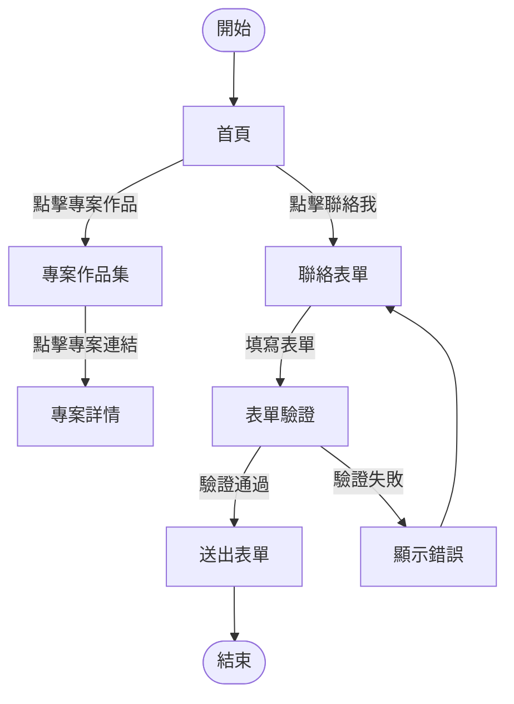

### FRD v1.0 ‧ 2025-07-06

#### 版本歷史
| 版本 | 日期 | 修改內容 | 負責人 |
|------|------|----------|--------|
| 1.0  | 2025-07-06 | 初版建立 | 系統自動生成 |

---

#### 1. 功能流程（BPMN）

---

#### 2. 功能需求與業務規則表
| 功能 | 描述 | 業務規則 | 驗證邏輯/資料校驗 | 邊界條件 | 追溯 PRD/BRD |
|------|------|----------|-------------------|----------|--------------|
| 個人簡介 | 展示姓名、背景、學經歷 | 僅顯示公開資訊 | 無 | 無 | PRD-1, BRD-5,6 |
| 技能展示 | 條列技術能力 | 技能分類、排序 | 無 | 技能數量不限 | PRD-2, BRD-5,6 |
| 專案作品集 | 展示專案、技術棧、連結 | 專案可多筆，連結需有效 | 連結格式驗證 | 專案數量不限 | PRD-3, BRD-5,6 |
| 聯絡表單 | 用戶填寫聯絡資訊 | 必填：姓名、Email、訊息 | Email 格式、訊息長度 | 姓名2-20字，訊息10-500字 | PRD-4,8, BRD-9,11 |
| 多語言切換 | 支援繁中/英文/日文 | 自動偵測/手動切換 | 語言資源載入驗證 | 預設繁中 | PRD-5, BRD-9 |
| 響應式設計 | 支援多裝置 | 斷點設計 | 無 | 螢幕寬度320px以上 | PRD-6, BRD-11 |
| 無障礙設計 | aria-*、label for、tab index | 所有互動元件需標註 | a11y 工具檢查 | 無 | PRD-7, BRD-11 |
| 表單驗證/XSS 防護 | 欄位驗證與安全 | 禁止惡意腳本 | DOMPurify 清理 | 無 | PRD-8, BRD-9,11 |
| 外部連結 | Email、LinkedIn、GitHub | 需新分頁開啟 | URL 格式驗證 | 連結失效顯示提示 | PRD-9, BRD-10 |

---

#### 3. 驗證邏輯與資料校驗
- Email 欄位必須符合 email 格式（正則驗證）
- 姓名欄位長度 2-20 字元
- 訊息內容長度 10-500 字元
- 所有輸入欄位送出前經 DOMPurify 清理
- 專案連結必須為有效 URL

---

#### 4. 邊界條件
- 表單欄位超出長度限制時，顯示錯誤提示
- 語言資源載入失敗時，顯示預設語言
- 專案連結失效時，顯示「連結無效」

---

#### 5. 追溯矩陣
| FRD 功能 ID | 來源 PRD 功能 ID | 來源 BRD 條款 ID |
|-------------|------------------|------------------|
| FRD-1（個人簡介） | PRD-1 | 5, 6 |
| FRD-2（技能展示） | PRD-2 | 5, 6 |
| FRD-3（專案作品集） | PRD-3 | 5, 6 |
| FRD-4（聯絡表單） | PRD-4,8 | 9, 11 |
| FRD-5（多語言切換） | PRD-5 | 9 |
| FRD-6（響應式設計） | PRD-6 | 11 |
| FRD-7（無障礙設計） | PRD-7 | 11 |
| FRD-8（表單驗證/XSS 防護） | PRD-8 | 9, 11 |
| FRD-9（外部連結） | PRD-9 | 10 |

---

#### 簽署確認
| 角色 | 姓名 | 簽名 | 日期 |
|------|------|------|------|
| 產品經理 | Chang Jung Lu | | 2025-07-06 |
| 技術負責人 | Chang Jung Lu | | 2025-07-06 |
| 設計負責人 | Chang Jung Lu | | 2025-07-06 |
| 專案經理 | Chang Jung Lu | | 2025-07-06 |

文檔狀態：□ 草稿  ■ 已核准  □ 已發布 