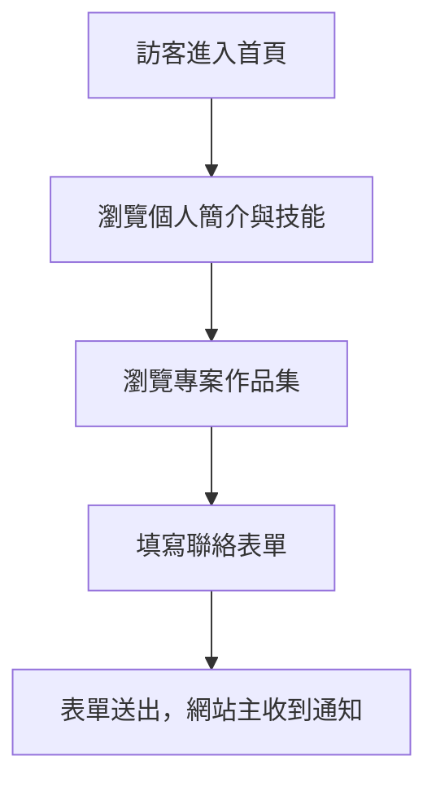

### BRD v1.0 ‧ 2025-07-06

#### 版本歷史
| 版本 | 日期 | 修改內容 | 負責人 |
|------|------|----------|--------|
| 1.0  | 2025-07-06 | 初版建立 | 系統自動生成 |

---

#### 1. 產品/專案名稱
Chang Jung Lu 個人品牌網站

#### 2. 業務目標
- 展示個人專業技能與專案成果，提升個人品牌形象
- 提供潛在客戶、合作夥伴聯絡管道
- 彙整技術經驗，作為職涯發展與業務拓展的數位名片

#### 3. 主要利害關係人
- Chang Jung Lu（網站擁有者/開發者）
- 潛在雇主、合作夥伴、客戶
- 技術社群成員

#### 4. 目標用戶
| 用戶類型 | 主要需求 | 典型場景 |
|----------|----------|----------|
| 潛在雇主/客戶 | 了解專業背景、聯絡合作 | 搜尋人才、尋找合作對象 |
| 技術同儕 | 參考技術實踐、交流經驗 | 技術分享、社群互動 |
| 一般訪客 | 認識 Chang Jung Lu | 網站瀏覽 |

#### 5. 核心業務需求
- 個人簡介、專業技能、學經歷展示
- 專案作品集（含技術棧、描述、連結）
- 聯絡表單（含驗證、XSS 防護）
- 多語言切換（繁中/英文/日文）
- 響應式設計，支援桌機與行動裝置

#### 6. 業務流程
1. 訪客進入首頁，瀏覽個人簡介與技能
2. 進一步瀏覽專案作品集，了解技術深度
3. 有合作/聯絡需求者，填寫聯絡表單
4. 表單送出後，網站主收到通知（未實作自動通知，僅前端 alert）

#### 7. 痛點與價值主張
- 痛點：傳統履歷難以動態展示專案成果，缺乏即時聯絡管道
- 價值：一站式個人品牌網站，結合專案、技能、聯絡於一體，提升專業形象與曝光

#### 8. 成功指標
- 網站訪問量、專案頁點擊率、聯絡表單送出次數
- 用戶回饋（滿意度、合作邀約數）

#### 9. 業務規則
- 聯絡表單必填欄位：姓名、Email、訊息內容
- Email 格式驗證，訊息長度限制
- 禁止惡意輸入（XSS 防護）
- 多語言自動偵測與切換

#### 10. 資料流與外部依賴
- 前端靜態網站，無後端資料庫（表單僅模擬送出）
- 依賴第三方：react-intl（i18n）、react-hook-form、zod、DOMPurify
- 聯絡資訊外部連結（Email、LinkedIn、GitHub）

#### 11. 非功能需求
- 響應式設計，支援桌機/平板/手機
- 載入速度快，首頁 2 秒內可見主要內容
- 無障礙設計（aria-*、label for、tab index）
- 安全性：表單 XSS 防護、Email 隱私保護

#### 12. 風險與假設
- 假設：網站僅作為個人品牌展示，暫無後端資料儲存需求
- 風險：表單資料未實際送出，需後續串接後端或第三方服務
- 依賴：第三方服務（如 LinkedIn、GitHub）可正常存取

#### 13. 術語表
| 術語 | 定義 |
|------|------|
| XSS | 跨站腳本攻擊（Cross-site Scripting） |
| i18n | 國際化（Internationalization） |
| SPA | 單頁應用程式（Single Page Application） |

#### 14. 相關文件
- 無（本 BRD 由現有 src 程式碼自動生成）

#### 15. 變更歷史
| 版本 | 日期 | 變更內容 |
|------|------|----------|
| 1.0  | 2025-07-06 | 初版建立 |

---

#### 簽署確認
| 角色 | 姓名 | 簽名 | 日期 |
|------|------|------|------|
| 產品經理 | Chang Jung Lu | | 2025-07-06 |
| 技術負責人 | Chang Jung Lu | | 2025-07-06 |
| 設計負責人 | Chang Jung Lu | | 2025-07-06 |
| 專案經理 | Chang Jung Lu | | 2025-07-06 |

文檔狀態：□ 草稿  ■ 已核准  □ 已發布 