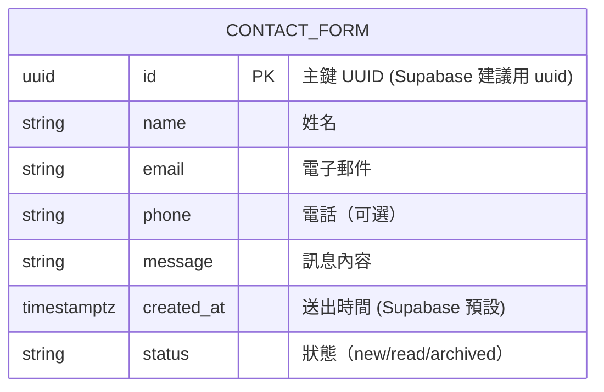

### 資料庫設計文件 v1.2 ‧ 2025-07-11

#### 版本歷史
| 版本 | 日期 | 修改內容 | 負責人 |
|------|------|----------|--------|
| 1.2  | 2025-07-11 | 補充支援 Supabase，欄位型別與約束說明 | 系統自動生成 |
| 1.1  | 2025-07-11 | 新增 phone 欄位，與前端聯絡表單同步 | 系統自動生成 |
| 1.0  | 2025-07-06 | 初版建立 | 系統自動生成 |

---

#### 1. ERD（Mermaid ER 圖）


---

#### 2. 主要表格定義（Supabase SQL DDL 範例）
```sql
create extension if not exists "uuid-ossp";

create table if not exists contact_form (
  id uuid primary key default uuid_generate_v4(),
  name varchar(20) not null,
  email varchar(100) not null,
  phone varchar(30),
  message text not null,
  created_at timestamptz not null default now(),
  status varchar(10) not null default 'new'
);

create index if not exists idx_contact_email on contact_form(email);
create index if not exists idx_contact_phone on contact_form(phone);
```

---

#### 3. 索引與約束
- 主鍵：id（UUID，Supabase 建議用 uuid_generate_v4）
- email、phone 欄位加索引，便於查詢
- status 欄位建議用 varchar(10) 或 enum
- created_at 自動記錄送出時間
- phone 欄位可為 NULL（對應前端可選填）

---

#### 4. Supabase 支援說明
- 本表格設計完全相容 Supabase PostgreSQL。
- 可直接用 Supabase Table Editor 建立，或用 SQL 執行上述 DDL。
- 前端可用 @supabase/supabase-js 直接 insert 聯絡表單資料。
- 欄位型別與驗證規則建議與前端同步。

---

#### 5. 資料保留政策
- 聯絡表單資料保存 2 年，逾期自動封存（status=archived）
- 用戶可依請求刪除個人資料（GDPR）
- 僅授權人員可查閱聯絡資料，並加密儲存 email、phone 欄位

---

#### 簽署確認
| 角色 | 姓名 | 簽名 | 日期 |
|------|------|------|------|
| 產品經理 | Chang Jung Lu | | 2025-07-11 |
| 技術負責人 | Chang Jung Lu | | 2025-07-11 |
| 設計負責人 | Chang Jung Lu | | 2025-07-11 |
| 專案經理 | Chang Jung Lu | | 2025-07-11 |

文檔狀態：□ 草稿  ■ 已核准  □ 已發布 