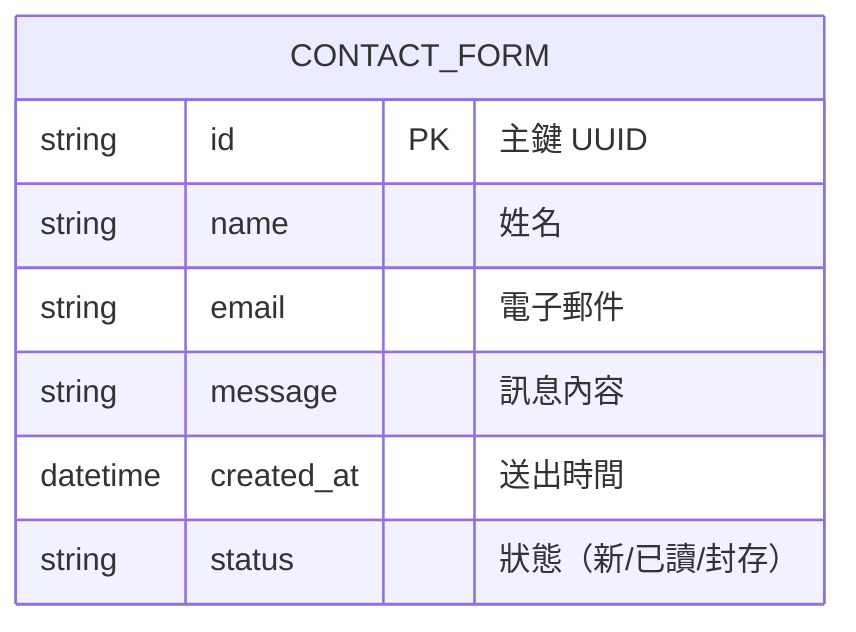

### 資料庫設計文件 v1.0 ‧ 2025-07-06

#### 版本歷史
| 版本 | 日期 | 修改內容 | 負責人 |
|------|------|----------|--------|
| 1.0  | 2025-07-06 | 初版建立 | 系統自動生成 |

---

#### 1. ERD（Mermaid ER 圖）


---

#### 2. 主要表格定義（SQL DDL）
```sql
CREATE TABLE contact_form (
  id VARCHAR(36) PRIMARY KEY COMMENT '主鍵 UUID',
  name VARCHAR(20) NOT NULL COMMENT '姓名',
  email VARCHAR(100) NOT NULL COMMENT '電子郵件',
  message TEXT NOT NULL COMMENT '訊息內容',
  created_at DATETIME NOT NULL DEFAULT CURRENT_TIMESTAMP COMMENT '送出時間',
  status ENUM('new','read','archived') NOT NULL DEFAULT 'new' COMMENT '狀態'
) COMMENT='聯絡表單紀錄';

CREATE INDEX idx_contact_email ON contact_form(email);
```

---

#### 3. 索引與約束
- 主鍵：id（UUID）
- email 欄位加索引，便於查詢
- status 欄位 ENUM，僅允許 'new'、'read'、'archived'
- created_at 自動記錄送出時間

---

#### 4. 資料保留政策
- 聯絡表單資料保存 2 年，逾期自動封存（status=archived）
- 用戶可依請求刪除個人資料（GDPR）
- 僅授權人員可查閱聯絡資料，並加密儲存 email 欄位

---

#### 簽署確認
| 角色 | 姓名 | 簽名 | 日期 |
|------|------|------|------|
| 產品經理 | Chang Jung Lu | | 2025-07-06 |
| 技術負責人 | Chang Jung Lu | | 2025-07-06 |
| 設計負責人 | Chang Jung Lu | | 2025-07-06 |
| 專案經理 | Chang Jung Lu | | 2025-07-06 |

文檔狀態：□ 草稿  ■ 已核准  □ 已發布 