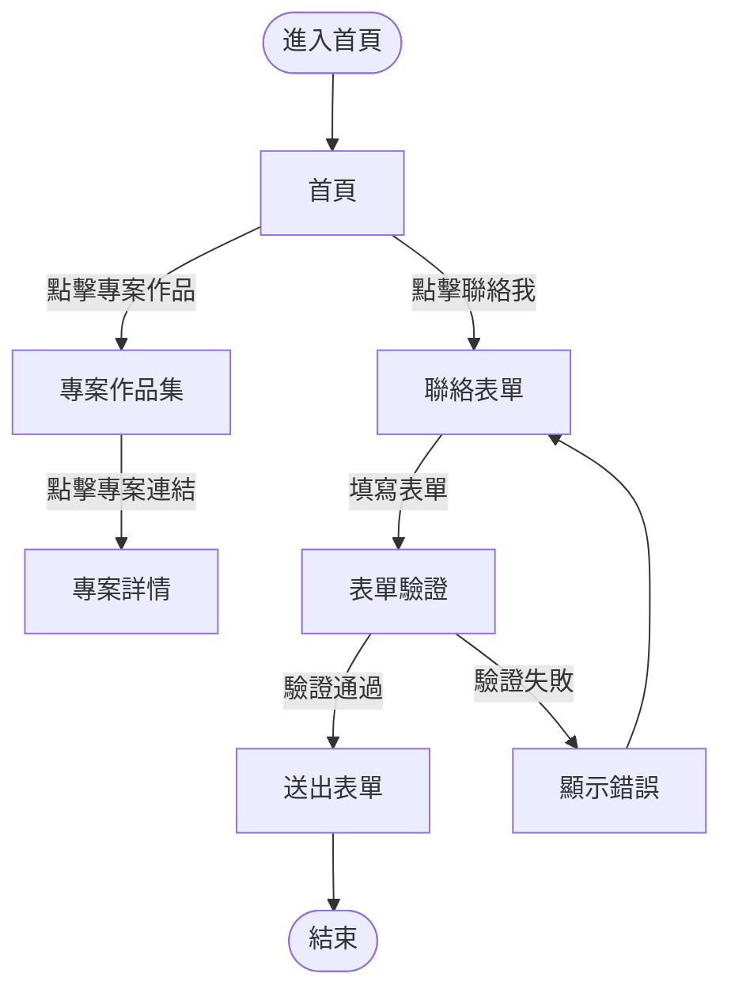

### UI／UX 設計說明文件 v1.0 ‧ 2025-07-06

#### 版本歷史
| 版本 | 日期 | 修改內容 | 負責人 |
|------|------|----------|--------|
| 1.0  | 2025-07-06 | 初版建立 | 系統自動生成 |

---

#### 1. 使用者流程圖


---

#### 2. 低保真 Wireframe（首頁、專案、聯絡頁）

**首頁 Wireframe**
```mermaid
wireframe
  page Home
    header "Chang Jung Lu" nav("首頁", "關於我", "專案作品", "聯絡我", lang)
    section "hero" {
      h1 "你好，我是 Chang Jung Lu"
      p "專業的軟體開發工程師..."
      btn "查看作品" btn "聯絡我"
    }
    section "skills" {
      h2 "核心技能"
      card "前端開發" card "後端開發" card "資料庫" card "雲端服務"
    }
    section "projects-preview" {
      h2 "最新專案"
      card "企業級電商平台" card "AI 數據分析平台"
    }
    footer "聯絡資訊 | 快速連結"
```

**專案頁 Wireframe**
```mermaid
wireframe
  page Projects
    header "Chang Jung Lu" nav("首頁", "關於我", "專案作品", "聯絡我", lang)
    section "projects-hero" {
      h1 "專案作品"
      p "精選專案與技術實踐"
    }
    section "projects-grid" {
      card "個人網站" card "其他專案..."
    }
    footer "聯絡資訊 | 快速連結"
```

**聯絡頁 Wireframe**
```mermaid
wireframe
  page Contact
    header "Chang Jung Lu" nav("首頁", "關於我", "專案作品", "聯絡我", lang)
    section "contact-hero" {
      h1 "聯絡我"
      p "歡迎透過下列表單與我聯繫！"
    }
    section "contact-content" {
      card "聯絡資訊"
      form "姓名" "Email" "訊息內容" btn "送出"
    }
    footer "聯絡資訊 | 快速連結"
```

---

#### 3. 無障礙與設計指導
- 色彩對比：主色（#2563eb）與背景、文字對比度 > 4.5:1，符合 WCAG AA
- tab index：所有互動元件（按鈕、表單、連結）皆可用 Tab 鍵切換
- aria-*：導航、表單、按鈕等皆加上 aria-label、aria-invalid、aria-busy 等
- label for：所有表單欄位皆有對應 label for
- 響應式設計：320px~1200px 皆無斷行錯誤
- 字體：主字體 Inter/Noto Sans TC，字級 16px 以上

---

#### 簽署確認
| 角色 | 姓名 | 簽名 | 日期 |
|------|------|------|------|
| 產品經理 | Chang Jung Lu | | 2025-07-06 |
| 技術負責人 | Chang Jung Lu | | 2025-07-06 |
| 設計負責人 | Chang Jung Lu | | 2025-07-06 |
| 專案經理 | Chang Jung Lu | | 2025-07-06 |

文檔狀態：□ 草稿  ■ 已核准  □ 已發布 