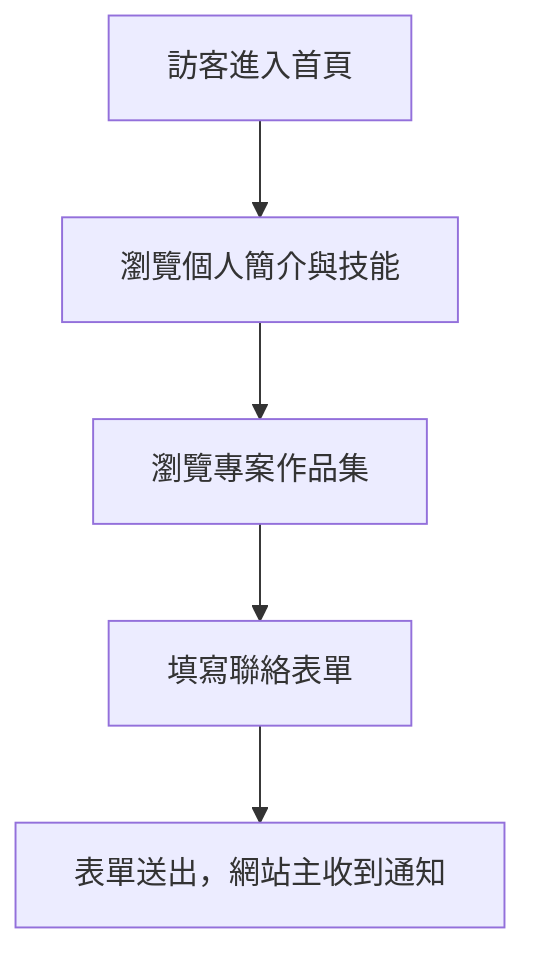

// ... existing code ...
#### 6. 業務流程
1. 訪客進入首頁，瀏覽個人簡介與技能
2. 進一步瀏覽專案作品集，了解技術深度
3. 有合作/聯絡需求者，填寫聯絡表單
4. 表單送出後，網站主收到通知（未實作自動通知，僅前端 alert）

```mermaid
flowchart TD
  A[訪客進入首頁] --> B[瀏覽個人簡介與技能]
  B --> C[瀏覽專案作品集]
  C --> D[填寫聯絡表單]
  D --> E[表單送出，網站主收到通知]
```
// ... existing code ...